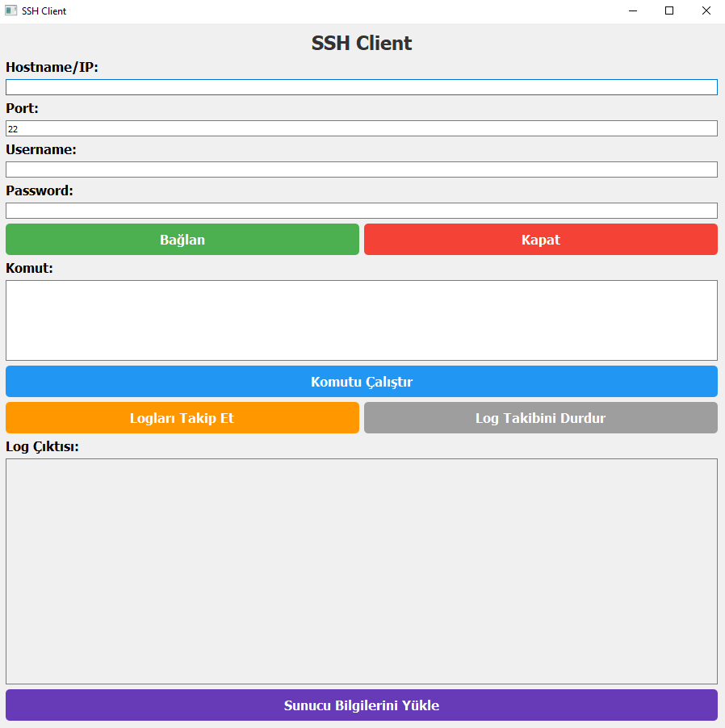

🚀 **Program Adı:** SSH Client Application
🔧 **Kullanılan Teknolojiler:** PyQt5, Paramiko, QThread

📜 **Açıklama:**
Bu Python programı, bir SSH istemcisi arayüzü sağlar ve kullanıcının uzak bir sunucuya bağlanarak komutlar çalıştırmasına, log dosyalarını takip etmesine olanak tanır. Uygulama PyQt5 kullanılarak GUI oluşturulmuş ve Paramiko kütüphanesiyle SSH bağlantısı yapılmıştır. 🌐

### Özellikler:
1. 🔗 **SSH Bağlantısı:**
   - Kullanıcı, uzak bir sunucuya bağlanmak için hostname, port, kullanıcı adı ve şifreyi girer. 🖥️
   - "Bağlan" butonuna tıklayarak SSH bağlantısı kurulur. ✔️
   - Bağlantı başarılı ise kullanıcıya bir bilgi mesajı gösterilir. 📲

2. 💻 **Komut Çalıştırma:**
   - Kullanıcı, komutları GUI üzerinden girebilir ve "Komutu Çalıştır" butonuna tıklayarak çalıştırabilir. ⌨️
   - Çalıştırılan komutun çıktısı ve hata mesajı ekranda görüntülenir. 📃

3. 📜 **Log Takibi:**
   - "Logları Takip Et" butonuyla, kullanıcı SSH üzerinden belirli bir log dosyasını takip edebilir. 📂
   - Log çıktıları GUI'de görüntülenir. 🖼️
   - Takip işlemi, "Log Takibini Durdur" butonuyla sonlandırılabilir. ⛔

4. ⚙️ **Sunucu Konfigürasyonu Yükleme:**
   - "Sunucu Bilgilerini Yükle" butonu ile, bir metin dosyasından (server_config.txt) sunucu bilgileri otomatik olarak yüklenebilir. 📑

### Teknik Özellikler:
- **PyQt5:** GUI bileşenleri için kullanıldı. 🖥️🎨
- **Paramiko:** SSH bağlantısı ve komut çalıştırma için kullanıldı. 🔑
- **QThread:** Arka planda çalışan log takibi işlemi için kullanıldı. 🕹️
